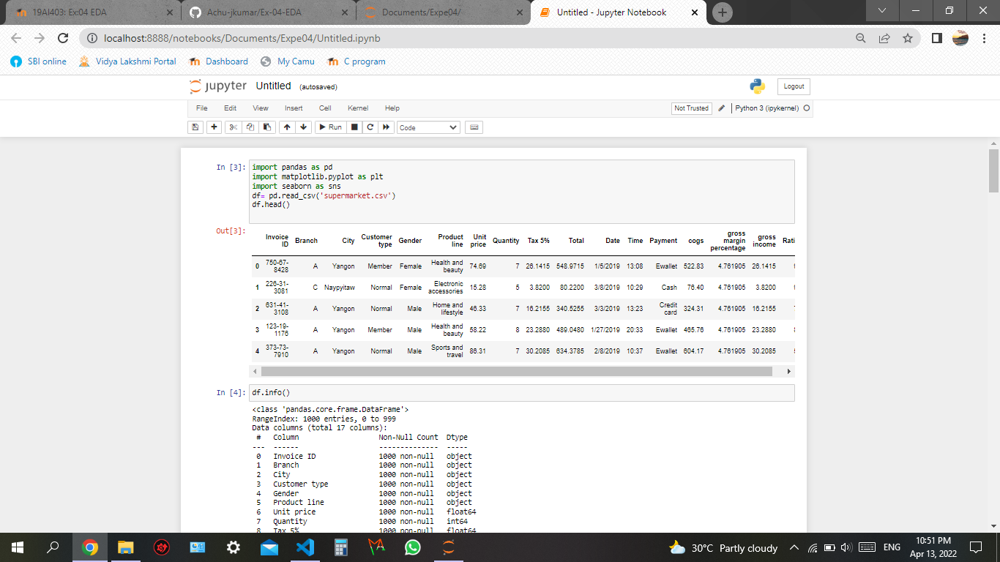
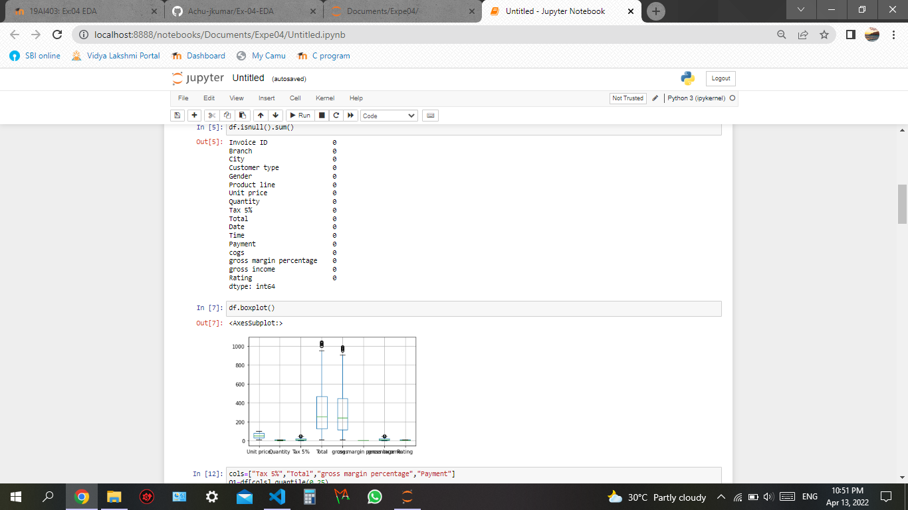
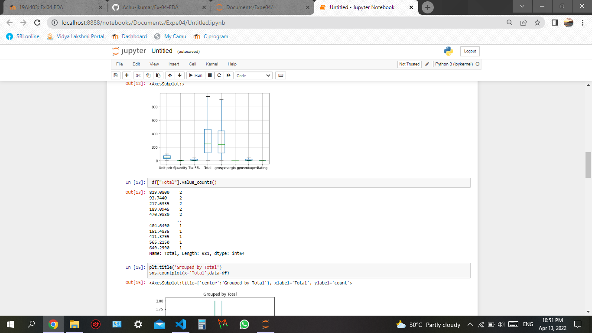
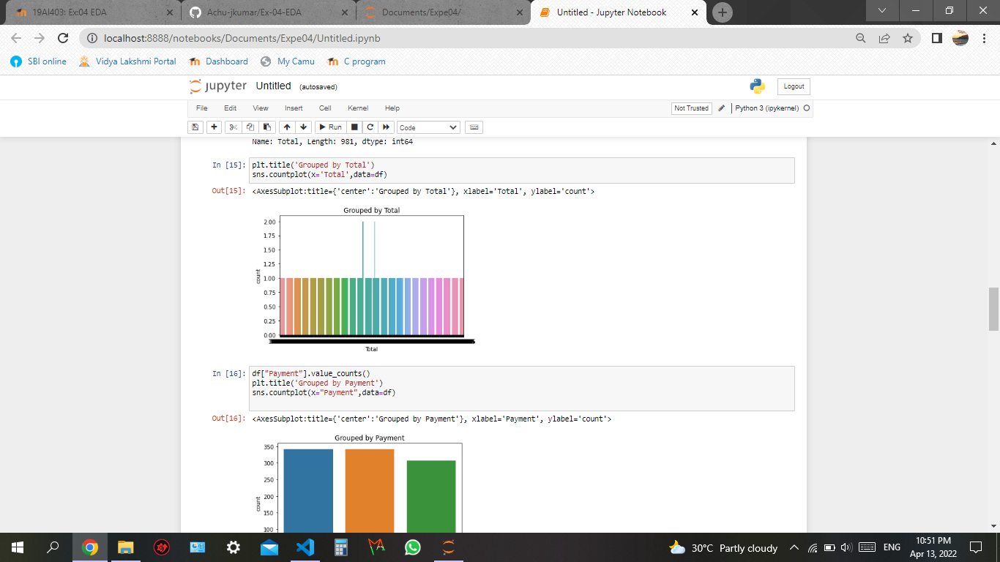
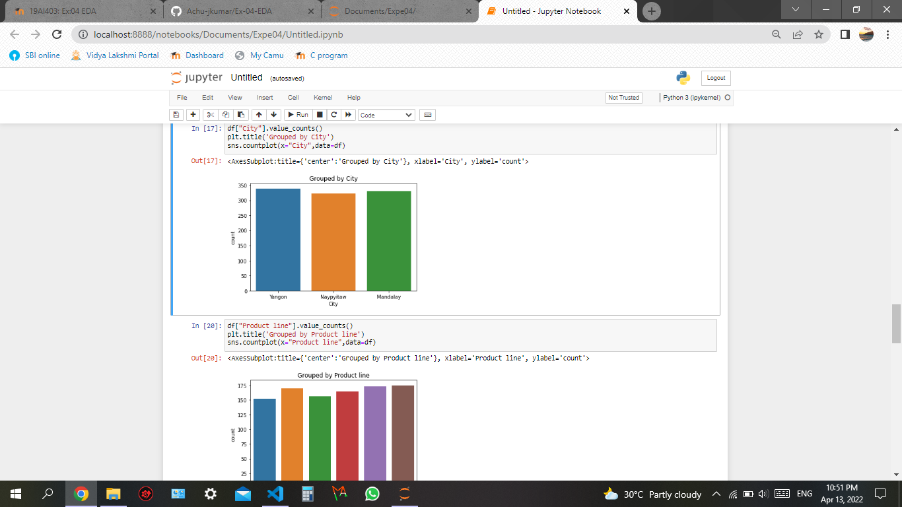
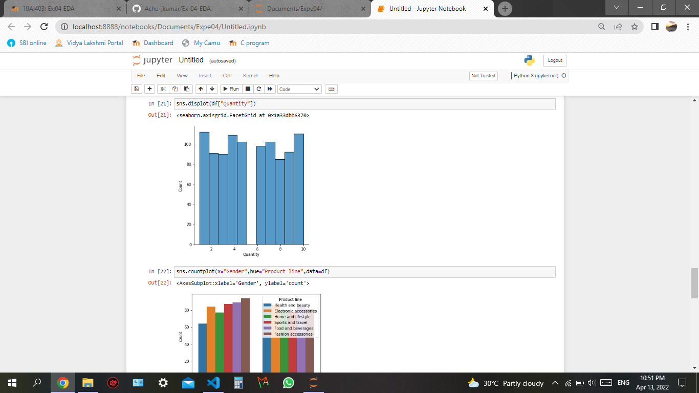
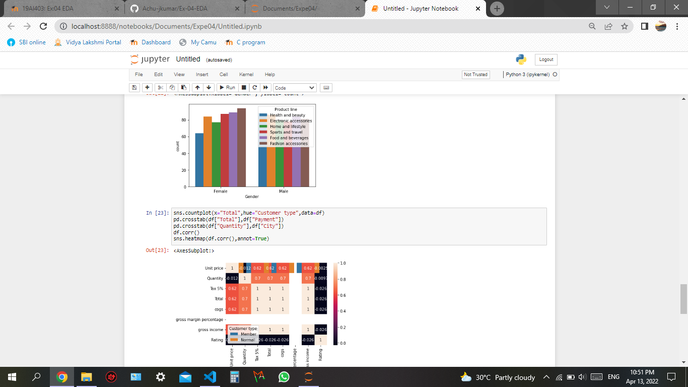
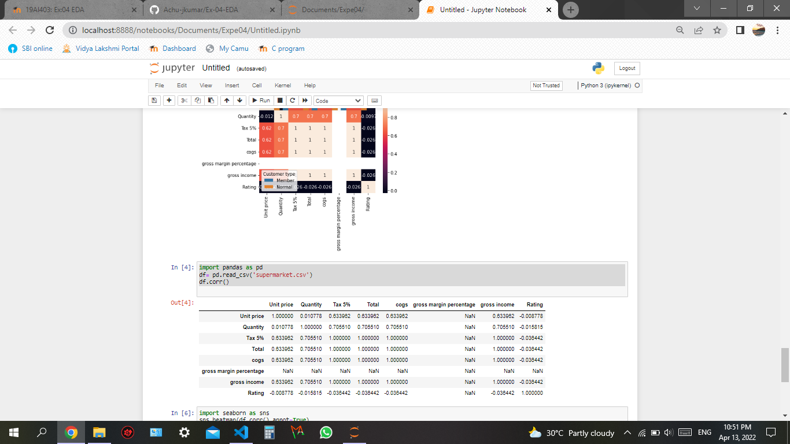

# Ex-04-EDA
# Aim:
 To Make an EDA graph of the given data set.
# Apparatus Required :
 Hardware- PC
 Software- Jupyter lab
# Algorithm:

## Step 1:
Import the built in libraries required for outlier removal and EDA operations.
## Step 2:
Using quantile and z-score method the outliers can be removed.
## Step3:
Using countplot the various data can be compared.
## Step 4:
Atlast the outliers are removed and the data are graphically and numerically compared and visualized.

# Code :
```
import pandas as pd
import matplotlib.pyplot as plt
import seaborn as sns
df= pd.read_csv('supermarket.csv')
df.head()

df.info()
df.isnull().sum()
df.boxplot()

cols=["Tax 5%","Total","gross margin percentage","Payment"]
Q1=df[cols].quantile(0.25)
Q3=df[cols].quantile(0.75)
IQR=Q3-Q1
df = df[~((df[cols] < (Q1 - 1.5 * IQR)) |(df[cols] > (Q3 + 1.5 * IQR))).any(axis=1)]
df.boxplot()

 df["Total"].value_counts()

 plt.title('Grouped by Total')
sns.countplot(x='Total',data=df)

df["Payment"].value_counts()
plt.title('Grouped by Payment')
sns.countplot(x="Payment",data=df)

df["City"].value_counts()
plt.title('Grouped by City')
sns.countplot(x="City",data=df)

df["Product line"].value_counts()
plt.title('Grouped by Product line')
sns.countplot(x="Product line",data=df)

sns.displot(df["Quantity"])
sns.countplot(x="Gender",hue="Product line",data=df)

sns.countplot(x="Total",hue="Customer type",data=df)
pd.crosstab(df["Total"],df["Payment"])
pd.crosstab(df["Quantity"],df["City"])
df.corr()

import pandas as pd
df= pd.read_csv('supermarket.csv')
df.corr()

import seaborn as sns
sns.heatmap(df.corr(),annot=True)

```
# Output :









# Result:
Thus the program to make an EDA graph of the given data set is successfully executed.
